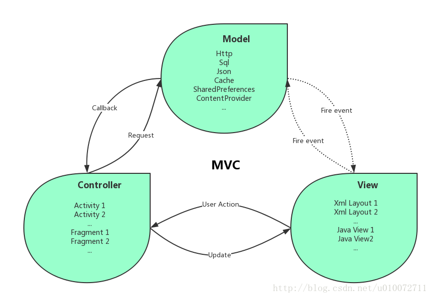
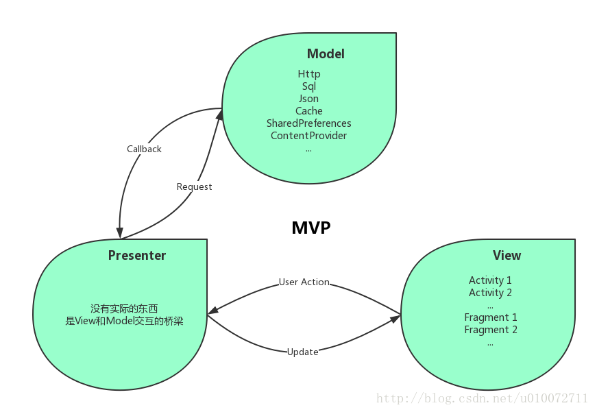

# PPIO API Demo Management

|Author | Ver | Create Time | Modified Time |
| ----- | --- | ----------- | ------------  |
|黄猿   | 0.1    |2018/10/28    | |

## 1. 设计目标

### 1.1 Goals

1. 建立PPIO的区块链SDK的开源的Android应用Demo，让第三方开发者能以最低的学习成本学习掌握PPIO区块链SDK

1. 实现验证PPIO区块链Android应用的各项功能，为正式的Android区块链应用开发做准备

### 1.2 Non-Goals

1. 实现Android区块链应用复杂绚丽的UI交互

1. 实现Android区块链应用能适配大量不同机型、不同版本的Android手机

1. 实现Android区块链应用的高性能和高可靠性

## 2. 设计概要

1. MVP模式

1. 体系架构设计

1. 评估体系架构设计

1. 开发流程和时间节点

## 3. MVP模式
好的软件设计是高内聚低耦合的，为了实现这个目标，Android开发人员发明了MVC(Model-View-Controller)开发模式，将UI部分和数据部分分割开来，并且提高了组件的重用性

MVC模式结构图[1]

但是MVC模式存在View层级和Model层级仍然有较多联系、Controller层级的Activity和Fragment在项目规模较大时非常臃肿不利于阅读维护等缺点，所以开发人员在MVC模式的基础上又发展出了MVP(Model-View-Presenter)开发模式，MVP模式将UI部分和数据部分彻底隔离开来，仅仅通过接口和Presenter进行间接的联系，View层级和Model层级各自的内部实现、接口都不会对对方的内部实现和接口造成影响，更进一步实现了高内聚低耦合，同时M还有高可读性、高可维护性、高可重用性、避免Activity内存泄漏、方便单元测试等优点

MVC模式结构图[2]

Demo应用使用MVP模式可以通过高可读性的代码降低第三方开发者的学习成本，高可维护性、高可重用性和利于单元测试有利于Demo应用验证测试功能模块和UI模块，所以PPIO的Android区块链Demo采用了MVP模式进行开发

## 4. 体系架构设计

### 4.1 用户界面架构设计

如上图所示，Demo应用有引导界面、注册界面、登录界面、主界面、交易记录界面、本地文件选择界面、上传界面、提取界面、续租界面等界面

Demo应用根据界面和相关功能可以划分为登录注册、网盘文件管理、本地文件上传、获取他人网盘文件、用户信息五大模块。模块内部的界面都使用单独的Activity实现，

其中：

1. 登录注册模块分为引导界面MainActivity、注册界面RegisterActivity、登录界面LoginActivity，

   + MainActivity：每次在完全退出应用后再次进入都会先进入MainActivity，MainActivity通过实现了判断登录状态功能的isLogged()接口判断用户是否登录，如果登录直接进入网盘文件管理界面，否则不进行任何跳转，用户可以选择点击进入RegisterActivity或者LoginActivity

         if(AccountUtil.isLogged()) {
            //自动跳转到网盘界面
         } else {
            //do nothing
         }

   + RegisterActivity：RegisterActivit使用用户的SeedPhrease通过SDK的相关方法进行网络通信验证身份进行登录，然后进入网盘文件管理界面PpioDataActivity
   + LoginActivity：同上

2. 网盘文件管理模块主要是网盘文件管理界面PpioDataActivity和续租设置界面RenewActivity，
   + PpioDataActivity：在PpioDataActivity有一个显示当前账户所有网盘文件的列表，点击列表会有文件操作选项弹窗，点击对应按钮可以进行下载、分享(获取文件分享码)、重命名、续租、删除、取消等操作，除了续租会进入续租设置界面进行续租线管参数设置外，下载等操作只会弹出支付、编辑、确认弹窗进行操作

         myFileListView.setOnItemClickListener(
             new OnItemClickListener() {
                 @Override
                 public void OnItemClick(AdapterView<?> parent, View view, int position, long id) {
                 new OptionsDialog(
                     new OptionsListener {
                         public void onDownload() {
                           //下载
                         }
                         public void onShare() {
                           //分享
                         }
                         ......
                     }
                   )
                 }
             }
         );

   + RenewActivity：可以设置将要续租的网盘文件的各项参数，如文件名称、存储时长、是否加密、用于悬赏的GasPrice等

3. PpioDataActivity点击上传按钮进入本地文件上传模块，上传模块主要包括本地文件选择界面LocalFilesListActivity和上传参数设置界面UploadActivity，

   + LocalFilesListActivity:
     LocalFilesListActivity是一个简易的文件管理器，能够进出文件夹选中文件，选中文件就进入UploadActivity

   + UploadActivity:与RenewActivity类似，UploadActivity设置上传文件的各项参数，确认支付后就会发布任务等待租户领取存储任务，租户领取任务后就完成存储

4. 网盘界面点击获取按钮进入获取他人文件模块GetActivity，首先是输入确认分享码界面，输入对应分享码后进可以选择下载或者拷贝到自己的网盘存储，其中选择拷贝到自己的网盘会进入上传界面发布存储任务

5. 网盘界面侧滑进入侧滑菜单栏，进入账户信息模块，

   + 在侧滑菜单栏可以查看账户相关信息，

   + 点击明细按钮进入交易明细界面BillActivity可以查看交易明细，

   + 点击版本按钮进入应用版本界面VersionActivity查看应用版本，

   + 点击登出按钮登出当前账号

### 4.2 功能架构设计
### 4.2.1模块化
网络通信、本地文件管理、区块链SDK调用等功能代码将各自封装到实现各自功能接口的方法的类中，外部直接调用实现的接口方法，方便修改优化和替换，比如上传调用BlockUtil.opload(uploadFile)，下载调用BlockUtil.download(uploadFile)等

部分UI代码也各自封装到类中，与调用代码分割开来，方便修改替换，因为Demo核心功能是向第三方开发者展示SDK的API的效果和调用方法，所以优先实现API的调用代码，前期UI效果前期尽可能简化，后期再使用完善的UI控件替换

### 4.2.2第三方框架
第三方框架功能强大，能减少很多工作量实现强大的功能和UI效果，但是经常存在版本之间的适配问题，而且第三方开源框架互相之间层层调用，一个框架出现问题就有可能导致连锁反应影响很多其他的开源框架，存在严重安全隐患，第三方开发者接触陌生的开源框架也会增加学习成本，所以Demo尽量降低对第三方框架的依赖，为降低开发成本，只在部分工作量大无法取消的模块使用OkHttp这类等成熟且被广泛使用的第三方框架

## 5. 评估目标体系设计
1. 前期开发效率：使用MVP模式和使用实现接口类方法建造功能模块都会有额外的代码工作，因此在初期实现整体代码时工作量较多，此阶段开发效率较低

1. 中后期开发效率：由于使用模块化的方法，而且整体耦合度低，因此中后期修改测试代码时工作量会减少很多，且难度降低，修改过的代码可靠性也会提高，因此中后期开发效率较高

1. 扩展性延续性：由于使用模块化的方法，部分功能代码和UI代码可以方便的修改和提取，可以用于正式的Android区块链应用的开发，本Demo应用可以方便地修改添加部分模块进行部分新的功能和UI的验证开发，条件合适时也可以在本Demo应用的基础上修改优化功能和UI模块实现正式的Android区块链应用

## 6. 开发流程和注意事项
## 6.1 开发流程
1. 实现整个应用的框架，实现每个界面的MVP结构

1. 与SDK开发人员合作，实现应用对SDK的API的调用
1. 根据设计，调整UI，解决重大功能Bug

## 6.2 开发时间节点

1. 2018年11月5日前完成Demo整体架构实现和完成SDK方法调用

1. 2018年11月12日前解决重大功能bug，并根据UI设计基本实现要求的UI界面

# 7. 引用
[1]https://blog.csdn.net/u010072711/article/details/77132403

[2]https://blog.csdn.net/u010072711/article/details/77132403
